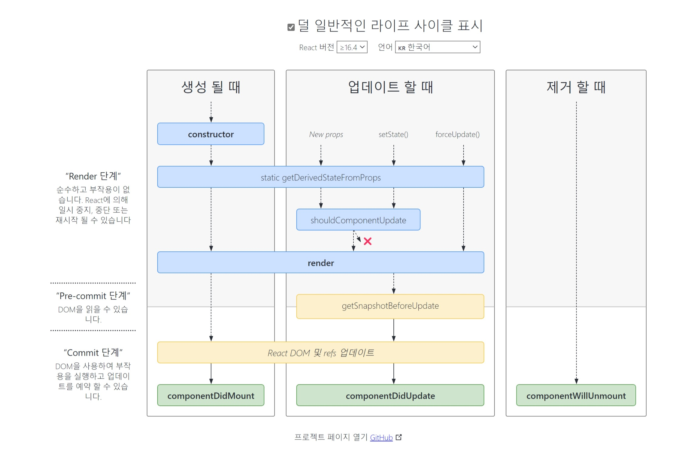

# lifeCycle

## lifeCycle 생명주기
리액트 컴포넌트에는 라이프사이클(수명주기)이 존재한다.  
라이프 사이클은 총 세가지 생명주기를 갖는다.
- 마운트 (mount) : DOM이 생성되고 웹 브라우저상 나타내는것  
- 업데이트 (update) : props/state가 바뀔때, 부모컴포넌트가 리렌더링될때, this.forceUpdate로 강제로 렌더링 트리거 시 발생  
- 언마운트 (unmount) : 컴포넌트를 DOM에서 제거하는 것  

프로젝트를 진행하다보면 처음 렌더링을 할때 어떤 작업을 처리해야하거나,  
컴포넌트 업데이트 전후로 특정 작업을 처리해야 할 수도 있고, 불필요한 업데이트를 방지해야 할 수도 있다.  
이때 사용하는것이 컴포넌트의 라이프사이클 메서드로, 클래스형 컴포넌트에서만 사용된다.  
함수형 컴포넌트에서는 Hooks의 기능을 이용하여 작업을 처리한다.

## 라이프사이클 메서드
메서드에 붙는 접두사에 따라 실행 순서를 구분할수있다.  
- Will 접두사 : 어떤 작업을 작동하기 전에 실행되는 메서드  
- Did 접두사 : 어떤 작업을 작동한 후에 실행되는 메서드  

### 마운트 (mount)할 때 호출되는 메서드  
1. `constructor` : 컴포넌트 생성자 메서드  
메서드를 바인딩하거나 state를 초기화하는 작업이 없다면, 구현하지 않아도 된다.    
2. `getDerivedStateFromProps` : props값을 state에 넣을때 사용  
상태를 업데이트하려면 개체(state) 를 반환하거나 아니면 null을 반환  
3. `render` : 렌더링 시 실행  
this.props와 this.state에 접근할수 있으며, 리액트 요소를 반환한다.  
이벤트 설정이 아닌곳에서 setState를 사용하면 안되며, 브라우저 DOM에 접근해도 안된다는점에 주의한다.  
4. `componentDidMount` : mount 후(첫 렌더링을 다 마친 후) 호출  
DOM에 접근할 수 있기때문에  여기서 다른 js라이브러리 또는 프레임워크 함수 호출, 이벤트등록, setTimeout, setInterval, 네트워크 요청같은 비동기 작업을 처리한다.  

### 업데이트 (update)할 때 호출되는 메서드  
1. `getDerivedStateFromProps` : props변화에따라 state값에도 변화를 주고싶을때 사용  
2. `shouldComponentUpdate` : 리렌더링을 할지말지 결정하는 메서드 (true/false반환) -> this.forceUpdate함수 호출 시 과정 생략  
3. `render`  
4. `getSnapshotBeforeUpdate` : 업데이트 바로직전 호출하는 메서드  
이 메서드에서 반환하는값은 componentDidUpdate에서 세번째 파라미터인 snapshot값으로 전달할수있으며,  
스크롤바 위치처럼 업데이트 직전값을 참고할일이 있을 때 활용  
5. `componentDidUpdate` : 업데이트 후 호출  
DOM 관련 처리를 해도 무방  

### 언마운트 (unmount) 할 때 호출되는 메서드
1. `componentWillUnmount` : 컴포넌트가 브라우저상에서 사라지기 전에 호출  
componentDidMount에서 등록한 이벤트, 타이머, 직접생성한 DOM이 있다면 여기서 제거

### Error  
`componentDidCatch 메서드` : 렌더링 도중에 에러가 발생했을때 오류 UI를 보여줄 수 있게 해준다.  
컴포넌트 자신에게 발생하는 에러는 잡을 수 없고,  
자신의 this.props.children으로 전달되는 컴포넌트에서 발생하는 에러만 잡아낼 수 있다.  

## 예제  
라이프사이클메서드를 실행할때마다 콘솔디버거에 기록하고,  
부모 컴포넌트에서 props로 색상을 받아 버튼을 누르면 state.number값을 1씩 더하는 예제  
(마지막 자리수가 4일때에는 업데이트하지 않음)  
~~~js
import { Component } from "react";

class LifeCycleSample extends Component {
    state = {
        number: 0,
        color: null
    }

    myRef = null;

    constructor(props){
        super(props);
        console.log('constructor');
    }

    // 부모에게 받은 color값을 state에 동기화
    static getDerivedStateFromProps(nextProps, prevState){
        console.log('getDerivedStateFromProps');
        if(nextProps.color !== prevState.color){
            return {color: nextProps.color};
        }
        return null;
    }

    componentDidMount() {
        console.log('componentDidMount');
    }

    // 숫자의 마지막 자리가 4면 리렌더링 하지 않는다.
    shouldComponentUpdate(nextProps, nextState){
        console.log('sholdComponentUpdate', nextProps, nextState);
        return nextState.number % 10 !== 4;
    }

    componentWillUnmount(){
        console.log('componentWillUnmount');
    }

    handleClick = ()=>{
        this.setState({
            number: this.state.number + 1
        });
    }

    // DOM 변화 일어나기 직전 색상을 snapshot으로 반환하여 componentDidUpdate에서 조회
    getSnapshotBeforeUpdate(prevProps, prevState){
        console.log('getSnapshotBeforeUpdate');
        if(prevProps.color !== this.props.color){
            return this.myRef.style.color;
        }
        return null;
    }

    componentDidUpdate(prevProps, prevState, snapShot){
        console.log('componentDidUpdate', prevProps, prevState);
        if(snapShot){
            console.log('업데이트 되기 직전 색상: ', snapShot);
        }
    }

    render(){
        console.log('render');

        const style = {color:this.props.color};

        return (
            <>
                <h1 style={style} ref={ref=>this.myRef=ref}>
                    {this.state.number}
                </h1>
                
color: {this.state.color}

                <button onClick={this.handleClick}>
                    더하기
                </button>
            </>
        )
    }
}

export default LifeCycleSample;
~~~

~~~js
import { Component } from "react";
import LifeCycleSample from "./LifeCycleSample";

function getRandomColor() {
  return '#' + Math.floor(Math.random() * 16777215).toString(16);
}

class App extends Component{
  state = {
    color: '#000000'
  }

  handleClick = () => {
    this.setState({color:getRandomColor()});
  }

  render(){
    return(
      <>
        <button onClick={this.handleClick}>랜덤색상</button>
        <LifeCycleSample color={this.state.color}></LifeCycleSample>
      </>     
  );
}};

export default App;
~~~

컴포넌트의 render함수에서 존재하지않는 함수를 사용하려하거나,  
존재하지않는 객체의 값을 조회하려고 할때 에러가 발생하는데  
이를 사용자에게 인지시켜주기위한 예제는 다음과 같다.  
~~~js
import { Component } from "react";

class ErrorBoundary extends Component{
    state = {error: false};

    componentDidCatch(error,info){
        this.setState({error:true});
        console.log({error, info});
    }

    render(){
        if(this.state.error) return 
에러가 발생했습니다!

        return this.props.children;
    }
}

export default ErrorBoundary;
~~~
## 참고
[리액트를 다루는 기술](http://www.kyobobook.co.kr/product/detailViewKor.laf?mallGb=KOR&ejkGb=KOR&barcode=9791160508796)

[react-lifecycle-methods-diagram](https://projects.wojtekmaj.pl/react-lifecycle-methods-diagram/)